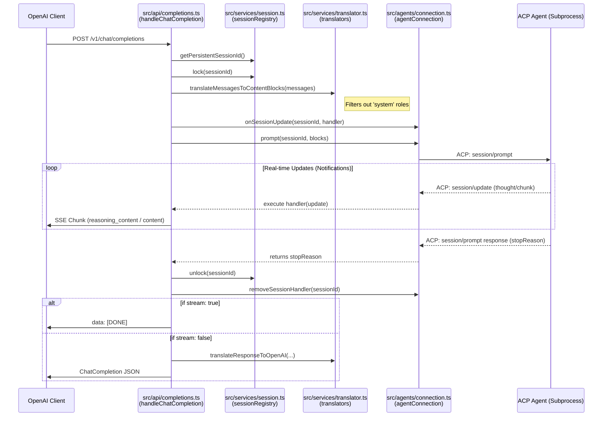

# ACP to OpenAI API Middleware

Bridge **ACP (Agent Client Protocol)** agents to **OpenAI-compatible API**. Enables tools like Open WebUI or AI coding assistants to use ACP agents as LLM providers.

## Features

- **OpenAI-Compatible API**: Works with any OpenAI client
- **Session Management**: Reuse sessions via `session_id`
- **Streaming Support**: SSE streaming for real-time responses
- **Tool Auto-Approval**: Automatically approve tool permissions with logging
- **Configurable**: YAML config + environment variable overrides

## Architecture

### Technical Sequence Diagram

The following diagram illustrates the internal function calls and message flow across the middleware components.



## Prerequisites

- Node.js 18+
- An ACP-compatible agent installed (e.g., `gemini-cli`)
- User logged in to the agent CLI

## Installation

### Global Installation (Recommended)
You can install this middleware as a global CLI tool directly from GitHub:

```bash
npm install -g tsc
npm install -g git+https://github.com/kasyfilaziz/acp-to-openai-api.git
```

Once installed, you can run the bridge from anywhere using:
```bash
acp-to-openai
```

### Local Development
```bash
git clone https://github.com/kasyfilaziz/acp-to-openai-api.git
cd acp-to-openai-api
npm install
npm run build
npm start
```

## Configuration

The middleware uses a hierarchical configuration system. Values are loaded in this order (highest priority first):
1. **Environment Variables**
2. **`config.yaml`** (checked in the current working directory)
3. **`.env` file** (checked in the current working directory)
4. **Internal Defaults**

### Environment Variables
| Variable | Description | Default |
| :--- | :--- | :--- |
| `AGENT_COMMAND` | The command to launch the ACP agent | `gemini` |
| `AGENT_ARGS` | Space-separated arguments for the agent | `--stdio` |
| `PORT` | The port for the OpenAI-compatible server | `8080` |
| `HOST` | The host address to bind to | `0.0.0.0` |
| `LOG_DIR` | Directory for log files | `/tmp/acp-middleware` |

### YAML Configuration (`config.yaml`)
Create this file in your project root or current folder:
```yaml
agent:
  command: "gemini"
  args:
    - "--acp"
    - "--yolo"
  cwd: "."

server:
  host: "0.0.0.0"
  port: 8080
```

## Test

Once the server is running, you can test it using standard `curl` commands.

**Non-streaming chat:**
```bash
curl http://localhost:8080/v1/chat/completions \
  -H "Content-Type: application/json" \
  -d '{
    "model": "gemini",
    "messages": [{"role": "user", "content": "Hello!"}]
  }'
```

**Streaming chat (with reasoning):**
```bash
curl http://localhost:8080/v1/chat/completions \
  -H "Content-Type: application/json" \
  -d '{
    "model": "gemini",
    "messages": [{"role": "user", "content": "Think step-by-step: how many r are in strawberry?"}],
    "stream": true
  }'
```

**Persistent Session:**
The tool automatically creates a `.acp_session` file in your current folder. Any request made without an explicit `session_id` will reuse this session, preserving your conversation history.


**List models:**
```bash
curl http://localhost:8080/v1/models
```

**Health check:**
```bash
curl http://localhost:8080/health
```

## Docker

```bash
docker build -t acp-middleware .
docker run -p 8080:8080 acp-middleware
```

## API Endpoints

| Method | Path | Description |
|--------|------|-------------|
| POST | `/v1/chat/completions` | Chat completions |
| GET | `/v1/models` | List models |
| GET | `/health` | Health check |

## Error Responses

Errors follow OpenAI format:

```json
{
  "error": {
    "message": "Error message",
    "type": "invalid_request_error",
    "code": "error_code"
  }
}
```

| HTTP Code | Error Type | Description |
|-----------|------------|-------------|
| 400 | invalid_request_error | Missing required fields |
| 404 | invalid_request_error | Session not found |
| 409 | invalid_request_error | Session is busy |
| 502 | api_error | Agent protocol error |
| 503 | api_error | Agent not ready |

## Logging

Logs are written to `/tmp/acp-middleware/acp-middleware.log`. Sensitive data is automatically redacted.

## License

ISC
